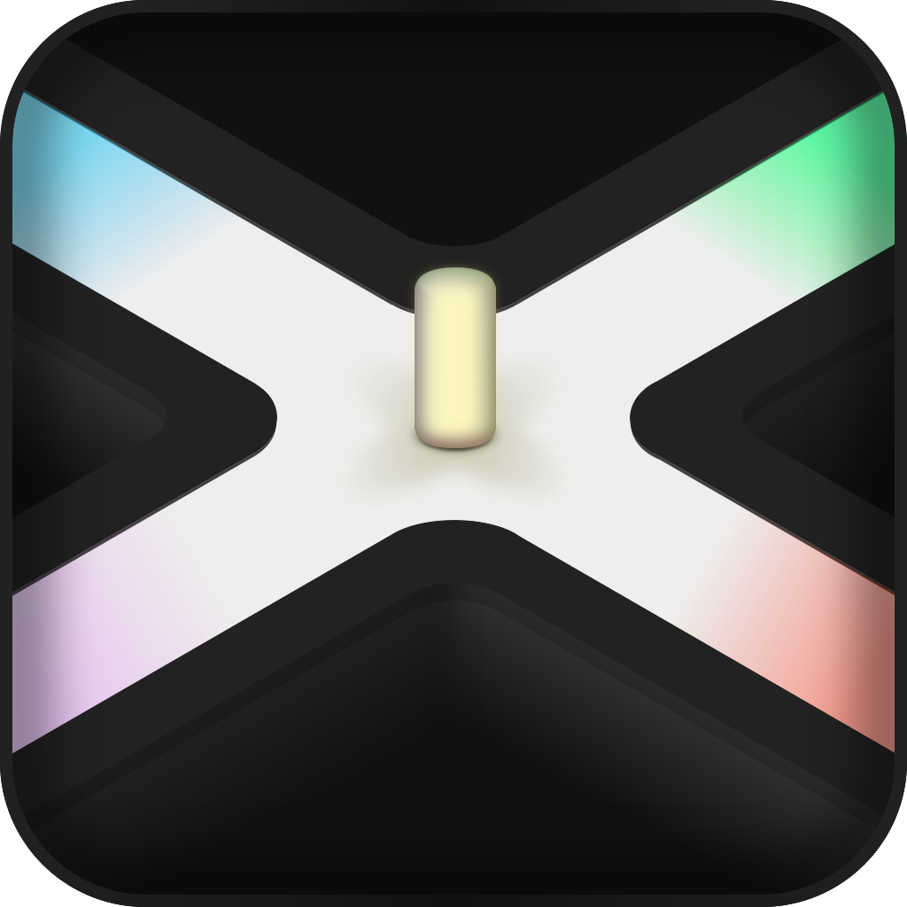
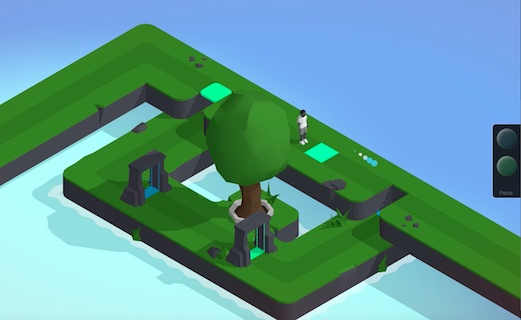
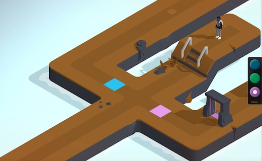
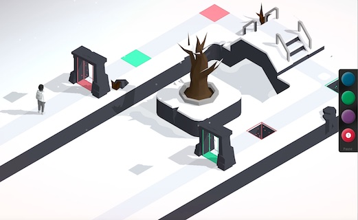

noon
====

This is the repository of the puzzle-game [noon](https://lisacintosh.itch.io/noon); with the version 1.0 released on July 2018.

Like the game and want to support? [PayPal](https://paypal.me/max174)

	

	He's feeling alone when trying to understand grown world, with these moments where even family seems to not get the answers...

Screenshots
-----------

How to play
-----------

Use the mouse to click on spots to move the boy.

Press orbs on right panel to release one of them, and long-press to absorb all these around.

Downloads
---------

Version 1.1 is available on [Linux](), [macOS]() and [Windows]().

_These binaries are not signed. Use them at your own risks._

Content
-------

_This is a complete game, not a tutorial; Don't create issue to ask question regarding the source code._

The project has been created with [Godot Engine](https://godotengine.org) 3.1 using GDScript (with most of static typing migration has been done) with no dependencies except [8SSEDT](https://github.com/Lisapple/8SSEDT) module only to re-generate distance maps.

Models have been created using Cheetah3D – I will certainly convert them to blender projects – and exported to Collada (`dae`) files.

Licences
--------

* The code is under [MIT](https://opensource.org/licenses/MIT) licence.
* All assets (sounds, music, models and textures) under [CC BY-NC](https://creativecommons.org/licenses/by-nc/4.0/) licence.
* The used font _Plume_ is a free font made by C. Verchery.

---

2019, Lisacintosh.